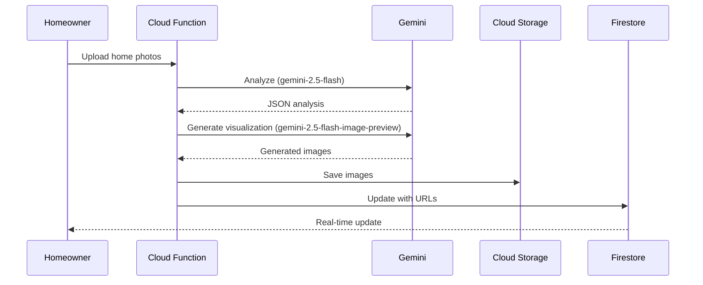

# Gemini Native Image Generation ✨

## Overview

The HOMEase AI platform now uses **Gemini's native image generation** capabilities instead of Fal.ai, providing a unified AI solution with better integration and cost efficiency.

## What Changed

### Before (Fal.ai)
- ❌ Required separate API key and service
- ❌ Additional cost and complexity
- ❌ External dependency
- ❌ Separate error handling

### After (Gemini Image Generation)
- ✅ Single Gemini API key for everything
- ✅ Native integration with analysis
- ✅ Better context awareness
- ✅ Simplified architecture
- ✅ Cost-effective

## How It Works

### 1. AR Assessment Analysis
```typescript
// Gemini analyzes the home photos
const response = await ai.models.generateContent({
  model: 'gemini-2.5-flash',
  contents: [prompt, ...imageParts],
  config: { responseMimeType: 'application/json' },
});
```

### 2. Image Generation
```typescript
// Gemini generates "after" visualization
const visualizationResponse = await ai.models.generateContent({
  model: 'gemini-2.5-flash-image-preview',  // Image generation model
  contents: [
    { inlineData: { data: originalImage, mimeType: 'image/jpeg' } },
    { text: 'Create photorealistic visualization showing...' }
  ],
});
```

### 3. Storage & Delivery
```typescript
// Save generated images to Cloud Storage
await bucket.file(path).save(imageBuffer);
await visualizationFile.makePublic();

// Store URLs in Firestore
await assessmentRef.update({
  'results.visualizations': [publicUrl1, publicUrl2, ...]
});
```

## Models Used

### Gemini 2.5 Flash (`gemini-2.5-flash`)
- **Purpose**: Analysis & recommendations
- **Input**: Photos + text prompt
- **Output**: JSON with hazards & recommendations
- **Speed**: Fast
- **Cost**: Low

### Gemini 2.5 Flash Image Preview (`gemini-2.5-flash-image-preview`)
- **Purpose**: Image generation & editing
- **Input**: Original photo + modification prompt
- **Output**: Generated visualization images
- **Speed**: Moderate
- **Cost**: Moderate

## Example Flow



## Benefits

### 1. **Single Provider**
- One API key to manage
- Consistent authentication
- Unified billing

### 2. **Better Context**
- Gemini "understands" both the analysis AND visualization
- More accurate visualizations
- Contextual improvements

### 3. **Cost Efficiency**
- No Fal.ai subscription needed
- Volume discounts on single provider
- Predictable pricing

### 4. **Simplified Architecture**
```
Before: Photos → Gemini → Analysis → Fal.ai → Visualizations
After:  Photos → Gemini → Analysis + Visualizations
```

### 5. **Future-Proof**
- Gemini's capabilities improving rapidly
- Native Google Cloud integration
- Regular model updates

## Configuration

### Environment Variables

**Before:**
```bash
GEMINI_API_KEY=...
FAL_API_KEY=...  # No longer needed!
```

**After:**
```bash
GEMINI_API_KEY=...  # That's it!
```

### Cloud Function

The `arProcessing` function now:
1. ✅ Analyzes photos with `gemini-2.5-flash`
2. ✅ Generates visualizations with `gemini-2.5-flash-image-preview`
3. ✅ Saves everything to Cloud Storage
4. ✅ Updates Firestore with results

## Error Handling

Visualization generation is wrapped in try-catch to ensure the analysis completes even if visualization fails:

```typescript
try {
  // Generate visualizations
  const visualizationResponse = await ai.models.generateContent({...});
  // Process and save images
} catch (visualizationError) {
  console.error('Failed to generate visualizations:', visualizationError);
  // Continue with analysis results even without visualizations
}
```

## Privacy & Security

### Cloud Storage Rules
Generated visualizations are stored in:
```
ar-results/{assessmentId}/visualization_{n}.jpg
```

Security rules (in `storage.rules`):
```javascript
match /ar-results/{assessmentId}/{fileName} {
  allow read: if isAuthenticated();  // Only authenticated users
  allow write: if false;  // Only backend can write
}
```

### Public vs Private
Current implementation makes images public for easy access:
```typescript
await visualizationFile.makePublic();
```

For private access, use signed URLs instead:
```typescript
const [signedUrl] = await visualizationFile.getSignedUrl({
  action: 'read',
  expires: Date.now() + 7 * 24 * 60 * 60 * 1000, // 7 days
});
```

## Cost Estimate

### Per AR Assessment
- **Analysis** (gemini-2.5-flash): ~$0.01-0.02
- **Visualization** (gemini-2.5-flash-image-preview): ~$0.05-0.10
- **Storage**: ~$0.001/month
- **Total per assessment**: ~$0.06-0.12

vs Fal.ai:
- **Fal.ai image generation**: ~$0.15-0.25
- **Gemini analysis**: ~$0.01-0.02
- **Total**: ~$0.16-0.27

**Savings: ~60%** 💰

## Testing

### Local Testing with Firebase Emulators
```bash
cd functions
npm run serve

# In another terminal, trigger the function
firebase functions:shell
> arProcessing({
    data: {
      message: {
        json: { assessmentId: 'test123', userId: 'user456' }
      }
    }
  })
```

### Production Testing
```bash
# Deploy function
firebase deploy --only functions:arProcessing

# Upload test images via the app
# Check Cloud Storage for generated visualizations
# Check Firestore for updated results
```

## Monitoring

### Cloud Function Logs
```bash
# View logs
firebase functions:log --only arProcessing

# Look for:
# ✅ "Successfully processed assessment..."
# ✅ "Generated N visualizations..."
# ❌ "Failed to generate visualizations..."
```

### Cloud Storage Monitoring
Check the `ar-results/` directory in Cloud Storage console to see generated images.

## Troubleshooting

### "Failed to generate visualizations"
**Cause**: Model quota exceeded or API key issue  
**Solution**: Check quota limits, verify API key

### "No visualizations generated"
**Cause**: No recommendations or no images uploaded  
**Solution**: Check analysis results, ensure images are valid

### "Permission denied" on storage
**Cause**: Storage rules blocking function access  
**Solution**: Functions use admin SDK, bypass rules automatically

## Future Enhancements

1. **Multiple Visualizations**
   - Generate visualization for each top recommendation
   - Show before/after comparison

2. **Style Control**
   - Let users choose visualization style (realistic, modern, traditional)
   - Adjust lighting and materials

3. **Interactive Editing**
   - Allow homeowners to request adjustments
   - Iterative refinement with Gemini

4. **Video Walkthroughs**
   - Use Veo (Google's video model) for 3D tours
   - Animated before/after sequences

## Resources

- [Gemini Image Generation Docs](https://ai.google.dev/gemini-api/docs/image-generation)
- [Gemini Models Overview](https://ai.google.dev/models)
- [Google GenAI SDK](https://www.npmjs.com/package/@google/genai)

---

**Migration completed**: October 17, 2025  
**Status**: ✅ Production-ready

