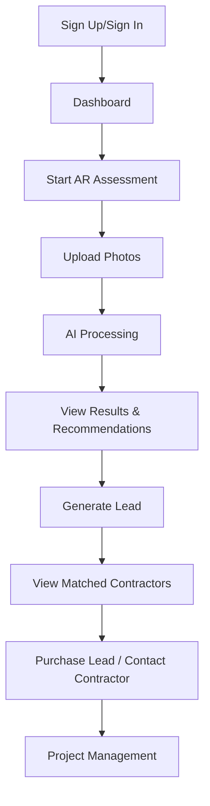

# Homeowner Features - Implementation Plan

## 📋 Overview

This document outlines the complete homeowner journey and features that need to be built for the HOMEase AI platform.

---

## 🎯 Homeowner User Journey



---

## 🏗️ Features to Build

### ✅ **1. Dashboard** (Already Exists)
**File**: `src/app/dashboard/homeowner/page.tsx`

**Current Status**: Basic structure exists
**Enhancements Needed**:
- [ ] Display recent assessments list
- [ ] Show active leads/projects
- [ ] Add quick stats (assessments done, leads sent, etc.)

---

### 🆕 **2. AR Assessment Upload Page**
**Path**: `/dashboard/homeowner/assessments/new`

**Features**:
- [ ] **Camera/File Upload Interface**
  - Support mobile camera capture
  - Support file upload (multiple images)
  - Image preview before upload
  - Drag-and-drop support
  
- [ ] **Room Selection**
  - Dropdown: Bathroom, Bedroom, Kitchen, Hallway, Stairs, Other
  - Optional description field
  
- [ ] **Progress Indicator**
  - Show upload progress
  - Show processing status
  
- [ ] **Firebase Storage Upload**
  - Upload to: `ar-assessments/{userId}/{assessmentId}/raw/`
  - Support multiple images per assessment
  
**Technical Requirements**:
```typescript
// Upload flow
1. User selects/captures images
2. Create Firestore document: ar-assessments/{id} with status: 'uploading'
3. Upload images to Cloud Storage
4. Call API: POST /api/ar-assessments/process with assessmentId
5. API updates status to 'processing' and triggers Pub/Sub
6. Redirect to results page with real-time listener
```

**UI Components Needed**:
- FileUploader component (drag-and-drop, preview)
- ImagePreview component
- ProgressBar component
- RoomSelector component

---

### 🆕 **3. AR Assessment Results Page**
**Path**: `/dashboard/homeowner/assessments/[id]`

**Features**:
- [ ] **Real-Time Status Updates**
  - Firestore listener for document changes
  - Status: uploading → processing → complete
  - Loading states and animations
  
- [ ] **Analysis Results Display**
  - List of detected hazards with severity badges
  - Recommendations with priority levels
  - Estimated costs for each recommendation
  
- [ ] **Before/After Visualizations**
  - Display Gemini-generated images
  - Side-by-side comparison
  - Zoom functionality
  
- [ ] **Action Buttons**
  - "Generate Lead" → Create lead for contractors
  - "Download Report" → PDF export
  - "Share Results" → Email/link
  
- [ ] **Error Handling**
  - Display if processing fails
  - Option to retry or contact support

**Data Structure**:
```typescript
interface Assessment {
  id: string;
  userId: string;
  createdAt: Timestamp;
  status: 'uploading' | 'processing' | 'complete' | 'failed';
  room: string;
  rawImages: string[]; // Cloud Storage URLs
  results?: {
    hazards: Hazard[];
    recommendations: Recommendation[];
    visualizations: string[]; // Generated image URLs
    analysisDate: Timestamp;
  };
}

interface Hazard {
  type: string;
  severity: 'low' | 'medium' | 'high';
  location: string;
  description: string;
}

interface Recommendation {
  title: string;
  description: string;
  priority: 'low' | 'medium' | 'high';
  estimatedCost: { min: number; max: number };
  relatedSpecialty: string;
}
```

---

### 🆕 **4. Assessment History/List Page**
**Path**: `/dashboard/homeowner/assessments`

**Features**:
- [ ] **Assessment List**
  - Grid/list view of all assessments
  - Thumbnail images
  - Status badges
  - Date created
  - Room type
  
- [ ] **Filtering & Sorting**
  - Filter by room type
  - Filter by status
  - Sort by date, room
  
- [ ] **Quick Actions**
  - View details
  - Generate lead (if not done)
  - Delete assessment

**UI**:
```
┌─────────────────────────────────────────────┐
│ My Assessments                 [+ New Assessment] │
├─────────────────────────────────────────────┤
│ Filter: [All Rooms ▼] [All Status ▼]       │
├─────────────────────────────────────────────┤
│ ┌──────────────────┐  ┌──────────────────┐ │
│ │ [Thumbnail]      │  │ [Thumbnail]      │ │
│ │ Bathroom         │  │ Kitchen          │ │
│ │ 2 hazards found  │  │ Processing...    │ │
│ │ Jan 15, 2025     │  │ Jan 14, 2025     │ │
│ │ [View Details]   │  │ [View Status]    │ │
│ └──────────────────┘  └──────────────────┘ │
└─────────────────────────────────────────────┘
```

---

### 🆕 **5. Lead Generation Form**
**Path**: `/dashboard/homeowner/leads/new?assessmentId={id}`

**Features**:
- [ ] **Pre-filled Data from Assessment**
  - Auto-populate from assessment results
  - Show recommendations
  
- [ ] **Lead Details Form**
  - Project description (pre-filled from assessment)
  - Urgency level (low/medium/high)
  - Budget range
  - Timeline preferences
  - Contact preferences
  
- [ ] **Location Information**
  - Address (required)
  - City, State, ZIP
  - Property type
  
- [ ] **Required Specialties**
  - Auto-selected based on recommendations
  - Manual selection available
  
- [ ] **Submit & Match**
  - Create lead in Firestore
  - Trigger contractor matching (Pub/Sub)
  - Redirect to matched contractors page

**API Endpoint**:
```typescript
// POST /api/leads/create
{
  arAssessmentId: string;
  description: string;
  urgency: 'low' | 'medium' | 'high';
  budgetRange: string;
  timeline: string;
  homeownerInfo: {
    address: string;
    city: string;
    state: string;
    zip: string;
    propertyType: string;
  };
  requiredSpecialties: string[];
}
```

---

### 🆕 **6. Matched Contractors Display**
**Path**: `/dashboard/homeowner/leads/[leadId]/contractors`

**Features**:
- [ ] **Contractor Cards**
  - Company name
  - Rating & review count
  - Specialties
  - Years of experience
  - Profile photo/logo
  
- [ ] **Contractor Details**
  - Portfolio/past projects
  - Certifications & licenses
  - Service area
  - Availability
  
- [ ] **Contact Actions**
  - "Request Quote" button
  - Direct message (future feature)
  - Phone number (if provided)
  
- [ ] **Real-Time Updates**
  - Firestore listener for new matches
  - Notification when contractors are matched

**UI**:
```
┌─────────────────────────────────────────────┐
│ Matched Contractors for Your Project        │
│ [Lead Details: Bathroom Accessibility]      │
├─────────────────────────────────────────────┤
│ ┌─────────────────────────────────────────┐ │
│ │ ABC Accessibility Inc.                  │ │
│ │ ⭐ 4.8 (42 reviews)                     │ │
│ │ Specialties: Bathroom Mods, Grab Bars  │ │
│ │ 15 years experience                     │ │
│ │ [View Profile] [Request Quote]          │ │
│ └─────────────────────────────────────────┘ │
│ ┌─────────────────────────────────────────┐ │
│ │ Home Safety Solutions                   │ │
│ │ ⭐ 4.9 (38 reviews)                     │ │
│ │ Specialties: Full Home Modifications   │ │
│ │ 12 years experience                     │ │
│ │ [View Profile] [Request Quote]          │ │
│ └─────────────────────────────────────────┘ │
└─────────────────────────────────────────────┘
```

---

### 🆕 **7. Project Management / Lead Status**
**Path**: `/dashboard/homeowner/leads/[leadId]`

**Features**:
- [ ] **Lead Status Tracking**
  - Status: new → matched → contacted → in_progress → completed
  - Timeline view
  
- [ ] **Contractor Responses**
  - View quotes received
  - Compare contractors
  
- [ ] **Communication Hub**
  - Message thread with contractor (future)
  - Contact history
  
- [ ] **Project Updates**
  - Milestones (future)
  - Photos/progress (future)
  
- [ ] **Review & Rating**
  - After completion, prompt for review
  - Star rating + written review

---

## 🛠️ API Routes to Build

### 1. **POST `/api/ar-assessments/create`**
```typescript
// Creates initial assessment document in Firestore
// Returns assessmentId for file uploads
{
  userId: string;
  room: string;
  description?: string;
}
→ Returns: { assessmentId: string }
```

### 2. **POST `/api/ar-assessments/process`**
```typescript
// Triggers Pub/Sub for AI processing
{
  assessmentId: string;
}
→ Returns: 202 Accepted
```

### 3. **GET `/api/ar-assessments/[id]`**
```typescript
// Get assessment details (with real-time via Firestore listener preferred)
→ Returns: Assessment object
```

### 4. **GET `/api/ar-assessments`**
```typescript
// List all assessments for current user
// Query params: room?, status?, limit?, offset?
→ Returns: { assessments: Assessment[] }
```

### 5. **POST `/api/leads/create`**
```typescript
// Creates lead and triggers contractor matching
{
  arAssessmentId: string;
  description: string;
  urgency: string;
  budgetRange: string;
  homeownerInfo: {...};
  requiredSpecialties: string[];
}
→ Returns: { leadId: string }
```

### 6. **GET `/api/leads/[leadId]/contractors`**
```typescript
// Get matched contractors for a lead
→ Returns: { contractors: ContractorProfile[] }
```

---

## 📦 Components to Build

### **Assessment Components**
- `AssessmentUploader` - Main upload interface
- `ImagePreview` - Preview uploaded images
- `RoomSelector` - Dropdown for room selection
- `UploadProgress` - Progress bar with status
- `AssessmentCard` - Grid item for assessment list
- `HazardList` - Display hazards with severity badges
- `RecommendationCard` - Single recommendation display
- `BeforeAfterCompare` - Side-by-side image comparison

### **Lead Components**
- `LeadGenerationForm` - Form to create leads
- `ContractorCard` - Display contractor info
- `ContractorList` - Grid of matched contractors
- `LeadStatusTimeline` - Visual timeline of lead progress
- `QuoteComparison` - Compare contractor quotes

### **Shared Components**
- `StatusBadge` - Colored badges for statuses
- `PriorityBadge` - Priority level indicators
- `LoadingSpinner` - Loading states
- `EmptyState` - Empty list/no data UI
- `ErrorMessage` - Error handling UI

---

## 🔐 Security Considerations

### **Firestore Rules**
```javascript
// Allow homeowners to read/write their own assessments
match /ar-assessments/{assessmentId} {
  allow create: if request.auth.uid != null && 
                request.resource.data.userId == request.auth.uid;
  allow read, update: if request.auth.uid == resource.data.userId;
}

// Allow homeowners to read/write their own leads
match /leads/{leadId} {
  allow create: if request.auth.uid != null && 
                request.resource.data.homeownerId == request.auth.uid;
  allow read, update: if request.auth.uid == resource.data.homeownerId;
}
```

### **Storage Rules**
```javascript
// Allow homeowners to upload to their own assessment folders
match /ar-assessments/{userId}/{assessmentId}/{allPaths=**} {
  allow write: if request.auth.uid == userId;
  allow read: if request.auth.uid == userId;
}

// Allow homeowners to read AI-generated results
match /ar-results/{assessmentId}/{allPaths=**} {
  allow read: if request.auth.uid != null;
  // Write is restricted to backend only
}
```

---

## 📊 Data Flow Summary

### **AR Assessment Flow**
```
User → Upload Images → Cloud Storage
     → Create Document → Firestore (status: uploading)
     → Call API → POST /api/ar-assessments/process
     → API → Pub/Sub (ar-assessment-created)
     → Cloud Function → Download images
     → Gemini API → Analyze & Generate
     → Update Firestore → (status: complete)
     → Real-time Listener → Update UI
```

### **Lead Generation Flow**
```
User → Fill Form → POST /api/leads/create
     → Create Document → Firestore (status: new)
     → Publish Message → Pub/Sub (lead-created)
     → Cloud Function → Match contractors
     → Update Firestore → (status: matched, matchedContractorIds)
     → Real-time Listener → Update UI
     → Display Contractors
```

---

## 🎨 Design Patterns

### **Real-Time Updates**
Use Firestore listeners for live updates:
```typescript
useEffect(() => {
  const unsubscribe = onSnapshot(
    doc(db, 'ar-assessments', assessmentId),
    (doc) => {
      setAssessment(doc.data());
    }
  );
  return unsubscribe;
}, [assessmentId]);
```

### **Optimistic UI**
Show loading states immediately, update on success:
```typescript
const handleUpload = async () => {
  setStatus('uploading');
  try {
    await uploadImages();
    await processAssessment();
    // Firestore listener will update automatically
  } catch (error) {
    setStatus('failed');
  }
};
```

### **Error Boundaries**
Wrap pages in error boundaries for graceful failures:
```typescript
<ErrorBoundary fallback={<ErrorPage />}>
  <AssessmentPage />
</ErrorBoundary>
```

---

## 🚀 Implementation Priority

### **Phase 1: Core Assessment Flow** (High Priority)
1. AR assessment upload page
2. `/api/ar-assessments/create` endpoint
3. `/api/ar-assessments/process` endpoint
4. Assessment results page with real-time updates
5. Assessment history/list page

### **Phase 2: Lead Generation** (High Priority)
6. Lead generation form
7. `/api/leads/create` endpoint
8. Matched contractors display page

### **Phase 3: Enhanced Features** (Medium Priority)
9. Project management/lead status tracking
10. Review & rating system
11. PDF report generation
12. Enhanced dashboard with stats

### **Phase 4: Advanced Features** (Future)
13. Real-time chat with contractors
14. Project milestone tracking
15. Payment integration for homeowners
16. Mobile app (React Native)

---

## 📝 Next Steps

1. **Start with Assessment Upload Page** (`/dashboard/homeowner/assessments/new`)
2. **Build API endpoints** for assessment creation and processing
3. **Create Results Page** with real-time Firestore listeners
4. **Test end-to-end flow** with Cloud Function (already built)
5. **Move to Lead Generation** after assessment flow works

---

## 🔗 Related Files

- **Architecture Doc**: `info.md`
- **Contractor Dashboard**: `CONTRACTOR_DASHBOARD_COMPLETE.md`
- **Setup Guide**: `FINAL_SETUP_STEPS.md`
- **Cloud Functions**: `functions/src/ar.ts`, `functions/src/leads.ts`
- **Firestore Rules**: `firestore.rules`
- **Storage Rules**: `storage.rules`

---

**Status**: Ready to implement 🚀
**Last Updated**: January 2025

